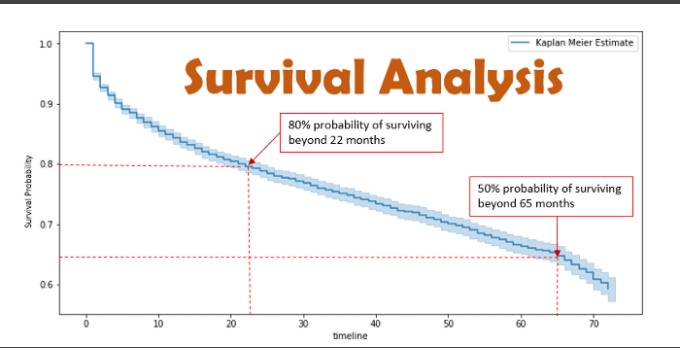
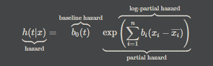

# Cox Regression (proportional hazards model)
[sample code](./cox_regression.py)  
This function fits Cox's proportional hazards model for survival-time (time-to-event) outcomes on one or more predictors.

Cox regression (or proportional hazards regression) is method for investigating the effect of several variables upon the time a specified event takes to happen.  
In the context of an outcome such as death this is known as Cox regression for survival analysis.  
The method does not assume any particular "survival model" but it is not truly nonparametric because it does assume that the effects of the predictor variables upon survival are constant over time and are additive in one scale.  

To understand `Cox Regression Regression`, it would be nice to learn first
the principials of `Servival Regression`
<p align="center">
  
</p>
<p align="center">
  
</p>

## Get Started
```cmd
cd ML_Regressions/cox_regression
python3 cox_regression.py
```

# Resources
- https://www.kaggle.com/bryanb/survival-analysis-with-cox-model-implementation
- https://kowshikchilamkurthy.medium.com/the-cox-proportional-hazards-model-da61616e2e50
- https://www.statsdirect.com/help/survival_analysis/cox_regression.htm
- http://www.sthda.com/english/wiki/cox-proportional-hazards-model
- https://github.com/havakv/pycox/blob/master/examples/01_introduction.ipynb

### Servival Regression
- https://www.statsmodels.org/stable/duration.html
- https://lifelines.readthedocs.io/en/latest/Survival%20Regression.html
- https://pub.towardsai.net/survival-analysis-with-python-tutorial-how-what-when-and-why-19a5cfb3c312
- https://humboldt-wi.github.io/blog/research/information_systems_1920/group2_survivalanalysis/