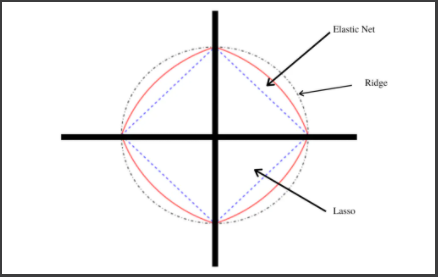
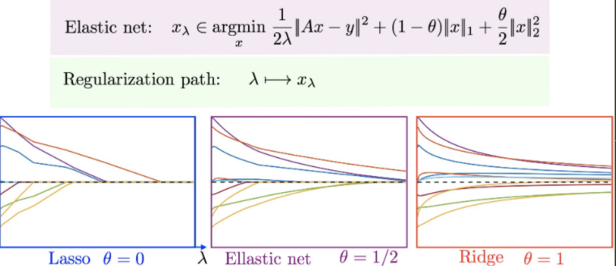
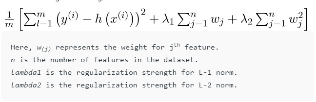

# Elastic Net Regression
[sample code](./elastic_net_regression.py)  
Regression is a modeling task that involves predicting a numeric value given an input.

Linear regression is the standard algorithm for regression that assumes a linear relationship between inputs and the target variable.  
An extension to linear regression involves adding penalties to the loss function during training that encourage simpler models that have smaller coefficient values.  
These extensions are referred to as regularized linear regression or penalized linear regression.  
`Elastic Net Regression` is a popular type of regularized linear regression that combines `Ridge Regression` and `Lasso Regression`.

To understand `Elastic Net Regression`, it would be nice to learn first:
- [Ridge Regression](../ridge_regression)
- [Lasso Regression](../lasso_regression)
<p align="center">
  
  
</p>
<p align="center">
  
</p>

## Get Started
```cmd
cd ML_Regressions/elastic_net_regression
python3 elastic_net_regression.py
```
# Resources
- https://medium.com/@jayeshbahire/lasso-ridge-and-elastic-net-regularization-4807897cb722
- https://towardsdatascience.com/from-linear-regression-to-ridge-regression-the-lasso-and-the-elastic-net-4eaecaf5f7e6
- https://www.datatechnotes.com/2019/08/elasticnet-regression-example-in-python.html
- https://www.geeksforgeeks.org/implementation-of-lasso-ridge-and-elastic-net/
- https://www.geeksforgeeks.org/implementation-of-elastic-net-regression-from-scratch/