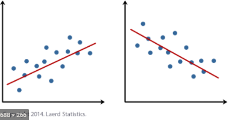
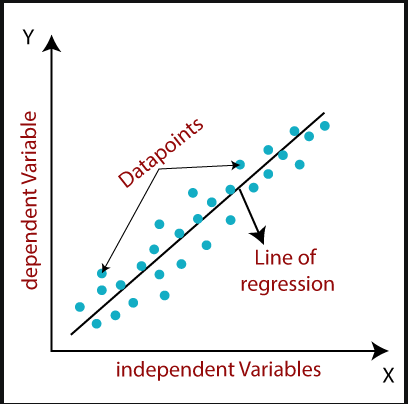
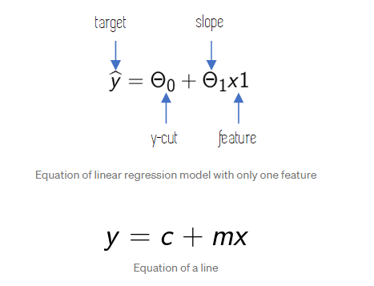
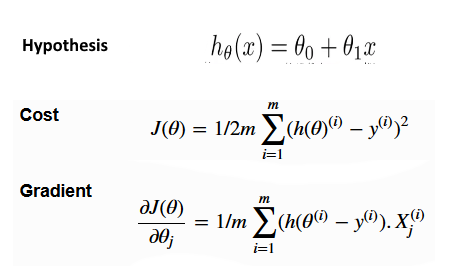
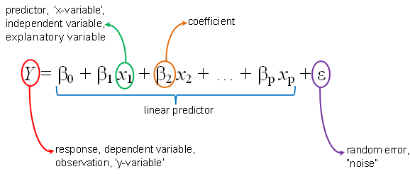
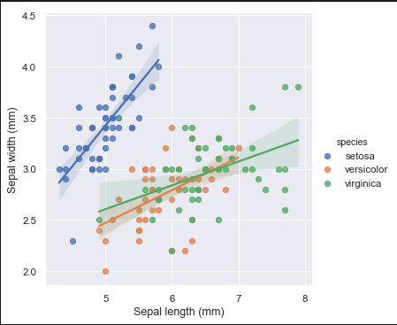

# Linear Regressions
Linear regression models are used to show or predict the relationship between two variables or factors. ([explanation](https://youtu.be/nk2CQITm_eo))  
There are 2 types of Linear Regressions.  
- Linear Regression  
(single `independent` variable (input) and a corresponding `dependent` variable (output))  
- Multiple Linear Regression  
(one continuous `dependent` variable and two or more `independent` variables)  

To understand `Linear Regression` , it would be nice to learn first:
- [Gradient Descent](https://github.com/niektuytel/ML_Algorithms/gradient_descent)
<p align="center">
  
  
</p>   

# Simple Linear Regression
[code sample](./simple_linear_regression.py)  

In Simple Linear Regression, we try to find the relationship between a single independent variable (input) and a corresponding dependent variable (output). This can be expressed in the form of a straight line.
The same equation of a line can be re-written as:

<p align="center">
  
</p>   

## Get Started
```cmd
cd ML_Regressions/linear_regression
python3 simple_linear_regression.py
```

Check [code sample](./simple_linear_regression.py) that is builded from scratch.  
The combination of following formules made the `Simple Linear regression` possible:
- [hypothesis](https://github.com/niektuytel/ML_Algorithms/gradient_descent/blob/main/images/hypothesis.png)
- [cost function](https://github.com/niektuytel/ML_Algorithms/gradient_descent/tree/main/cost_functions)
- [gradient descent](https://github.com/niektuytel/ML_Algorithms/gradient_descent)

<p align="center">
  
</p>   
<p align="center">
  
</p>


# Multiple Linear Regression
[code sample](./multiple_linear_regression.py)   

Multiple Linear Regression attempts to model the relationship between two or more features and a response by fitting a linear equation to observed data.  
The steps to perform `multiple linear Regression` are almost similar to that of `simple linear Regression`.  
The Difference Lies in the `evaluation`. We can use it to find out which factor has the highest impact on the predicted output and now different variable relate to each other.  
We are required to rescale our data, when some values are way different than other values, this can lead to that the average value is not average on the graph ([brouder explanation](https://github.com/niektuytel/ML_Algorithms/gradient_descent#scaling))  

<p align="center">
  
</p>   

## Get Started
```cmd
cd ML_Regressions/linear_regression
python3 multiple_linear_regression.py
```

Check [code sample](./multiple_linear_regression.py) that is builded from scratch.  
When i merge multi data into 1 array and get 1 line out of it is possible, but could cause `fake` data information, we call this [`overfitting`](https://elitedatascience.com/overfitting-in-machine-learning).  d
The combination of following formules made the `Multiple Linear regression` possible:
- [hypothesis](https://github.com/niektuytel/ML_Algorithms/gradient_descent/blob/main/images/hypothesis.png)
- [cost function](https://github.com/niektuytel/ML_Algorithms/gradient_descent/tree/main/cost_functions)
- [gradient descent](https://github.com/niektuytel/ML_Algorithms/gradient_descent)

<p align="center">
  
</p>   
<p align="center">
  
</p>

# Resources
### Simple linear regression :
- https://towardsdatascience.com/linear-regression-explained-d0a1068accb9  
- https://philippmuens.com/linear-and-multiple-regression-from-scratch

### Multiple linear regression :
- https://medium.com/@lope.ai/multivariate-linear-regression-from-scratch-in-python-5c4f219be6a  
- https://satishgunjal.com/multivariate_lr/  
- https://towardsdatascience.com/multiple-linear-regression-from-scratch-in-numpy-36a3e8ac8014  
- https://medium.com/@rgotesman1/learning-machine-learning-part-2-multiple-linear-regression-41d227c28dac#:~:text=Theta%20zero%20represents%20the%20value,x_i%20increases%20by%201%20unit.

### (extra)
- https://alexandrugris.github.io/machine/learning/2017/03/25/MachineLearning-Notebook-2.html
- https://www.listendata.com/2018/03/regression-analysis.html#What-is-Regression-Analysis-  