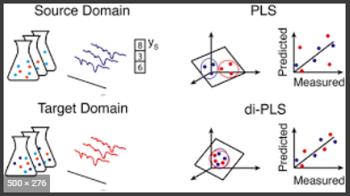
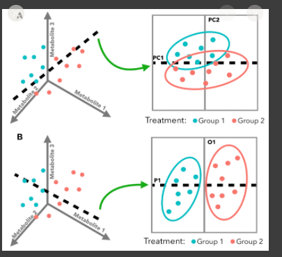
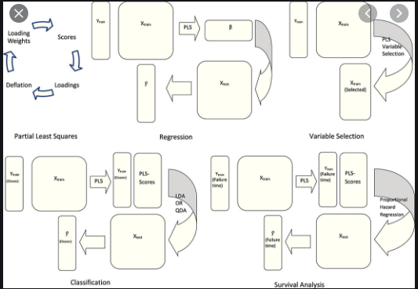
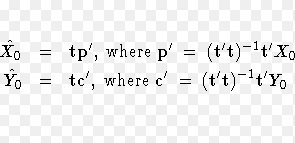

# Partial Least Squares Regression (PLS)
[sample code](./partial_least_squares_regression.py)  
`Partial Least Squares Regression` is similar to `Principal Components Regression`, in that regression is done on scores. The difference is that the responses y (Y) are used to find scores that have a large covariance between X and y (Y). One advantage of `Partial Least Squares Regression` over `Principal Components Regression` is that the number of required components is reduced.

To understand `Partial Least Squares Regression`, it would be nice to learn first:
- [Principal Components Regression](../principal_components_regression)
<p align="center">
  
</p>   
<p align="center">
  
  
</p>   
<p align="center">
  
</p>   

## Get Started
```cmd
cd ML_Regressions/partial_least_squares_regression
python3 partial_least_squares_regression.py
```

# Resources
- https://www.kaggle.com/phamvanvung/partial-least-squares-regression-in-python
- https://support.minitab.com/en-us/minitab/18/help-and-how-to/modeling-statistics/regression/supporting-topics/partial-least-squares-regression/what-is-partial-least-squares-regression/
- https://stats.stackexchange.com/questions/461752/partial-least-squares-using-python-understanding-predictions
- https://www.frontiersin.org/articles/10.3389/fnins.2019.01282/full
- https://personal.utdallas.edu/~herve/Abdi-PLS-pretty.pdf

