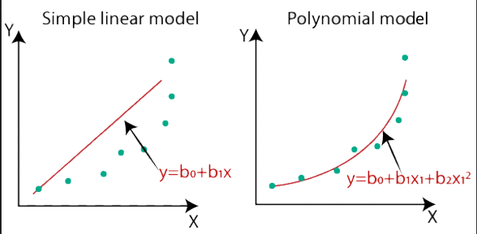
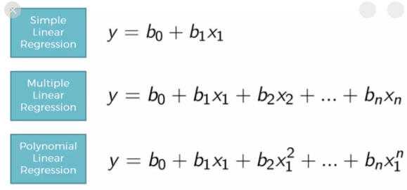

# Polynomial Regression
[code sample](./polynomial_regression.py)   

In statistics, polynomial regression is a form of regression analysis in which the relationship between the independent variable x and the dependent variable y is modelled as an nth degree polynomial in x.  
polynomial regression is considered to be a special case of multiple linear regression.

To understand `Gradient Boosting` , it would be nice to learn first:
- [Gradient Descent](https://github.com/niektuytel/ML_Algorithms/gradient_descent)
<p align="center">
  
  
</p>   
<p align="center">
  
</p>   

## Get Started
```cmd
cd ML_Regressions/polynomial_regression
python3 polynomial_regression.py
```

# Resources
- https://medium.datadriveninvestor.com/complete-guide-on-linear-regression-vs-polynomial-regression-with-implementation-in-python-964c64c28aa8
- http://polynomialregression.drque.net/math.html  
- https://regenerativetoday.com/polynomial-regression-from-scratch-in-python/  
- https://rickwierenga.com/blog/ml-fundamentals/polynomial-regression.html  
- https://github.com/pickus91/Polynomial-Regression-From-Scratch  
- https://hackerstreak.com/polynomial-regression-from-scratch/

#### (extra)
- https://alexandrugris.github.io/machine/learning/2017/03/25/MachineLearning-Notebook-2.html
- https://www.listendata.com/2018/03/regression-analysis.html#What-is-Regression-Analysis-  