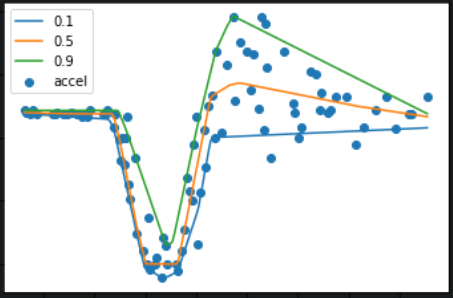
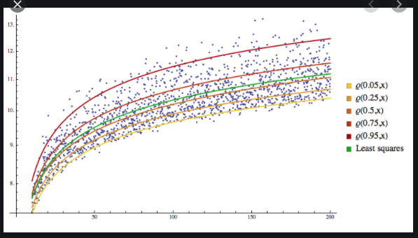
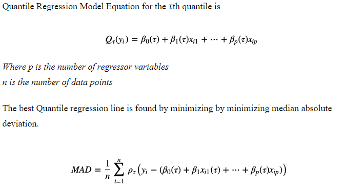

# Quantile Regression  
[sample code](./quantile_regression.py)

Quantile regression is an extension of `Standard linear regression`, which estimates the conditional median of the outcome variable and can be used when assumptions of `linear regression` do not meet.  
Suppose a real estate analyst wants to predict home prices from factors like home age and distance from job centers.  
The typical goal will be generating the best home price point estimate given those factors, where “best” often refers to the estimate that minimizes squared deviations from reality.  
But what if they want to predict not just a single estimate, but also the likely range? This is called the prediction interval, and the general method for producing them is known as `Quantile Regression`.  


To understand `Quantile Regression`, it would be nice to learn first:
- [Gradient Boosting](https://github.com/niektuytel/ML_Algorithms/gradient_boosting)
<p align="center">
  
  
</p>
<p align="center">
  
</p>   

## Get Started
```cmd
cd ML_Regressions/quantile_regression
python3 quantile_regression.py
```

# Resources
#### explanation
- https://saattrupdan.github.io/2020-03-09-quantile-regression/
- https://saattrupdan.github.io/2020-04-05-quantile-regression-forests/
- https://www.kaggle.com/editht/quantile-regression-vs-gradient-boosting

#### documents
- https://www.jmlr.org/papers/volume7/meinshausen06a/meinshausen06a.pdf
- https://support.sas.com/resources/papers/proceedings17/SAS0525-2017.pdf
- https://core.ac.uk/download/pdf/268632093.pdf

#### code
- https://scikit-learn.org/stable/auto_examples/ensemble/plot_gradient_boosting_quantile.html
- https://scikit-garden.github.io/examples/QuantileRegressionForests/  
- https://www.kaggle.com/editht/quantile-regression-vs-gradient-boosting
- https://github.com/yromano/cqr
- https://phillipmfeldman.org/Python/quantile_regression_demo.py

#### snag
- https://stackoverflow.com/questions/51483951/quantile-random-forests-from-scikit-garden-very-slow-at-making-predictions

