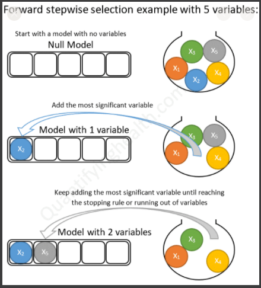
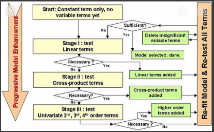

# Stepwise Regression
[sample code](./stepwise_regression.py)

Stepwise regression is the step-by-step iterative construction of a regression model that involves the selection of independent variables to be used in a final model. It involves adding or removing potential explanatory variables in succession and testing for statistical significance after each iteration.

<p align="center">
  
  
</p>

## Get Started
```cmd
cd ML_Regressions/stepwise_regression
python3 stepwise_regression.py
```

# Resources
- https://www.real-statistics.com/multiple-regression/stepwise-regression/
- https://automaticaddison.com/stepwise-forward-selection-algorithm-from-scratch/
- https://www.kdnuggets.com/2016/08/winner-stepwise-regression.html
- https://ncss-wpengine.netdna-ssl.com/wp-content/themes/ncss/pdf/Procedures/NCSS/Stepwise_Regression.pdf 


