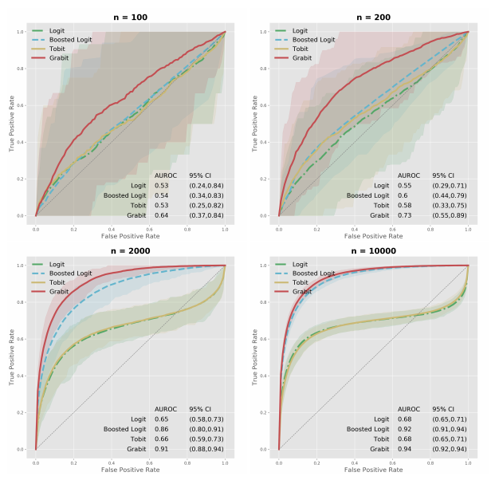

# Stepwise Regression
[sample code](./tobit_regression.py)

Tobit regression is a form of censored regression that can handle a mix of left- and right-censored (and, of course, uncensored) observations of the target variable.

<p align="center">
  
</p>

## Get Started
```cmd
cd ML_Regressions/tobit_regression
python3 tobit_regression.py
```


# Resource
- https://m-clark.github.io/models-by-example/tobit.html
- https://arxiv.org/pdf/1711.08695.pdf