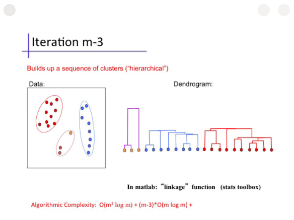
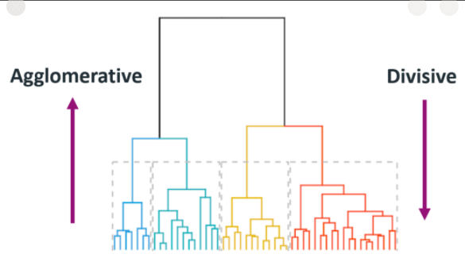
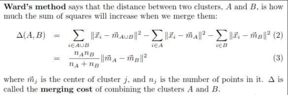

# Agglomerative Clustering
[`Agglomerative Clustering`](https://www.mygreatlearning.com/blog/hierarchical-clustering/) is the most common type of hierarchical clustering used to group objects in clusters based on their similarity.  
It’s also known as AGNES (Agglomerative Nesting).  
The algorithm starts by treating each object as a singleton cluster.  
Next, pairs of clusters are successively merged until all clusters have been merged into one big cluster containing all objects.  
The result is a tree-based representation of the objects, named `Dendrogram`.

  
  

  

### code 
[`python3 agglomerative_clustering_scratch.py`](./agglomerative_clustering_scratch.py)  
[`python3 agglomerative_clustering.py`](./agglomerative_clustering.py)  

## Resources
https://github.com/Darkprogrammerpb/DeepLearningProjects/blob/master/Project40/agglomerative_hierarchial_clustering/Hierarchial%20Agglomerative%20clustering.ipynb  
https://www.youtube.com/watch?v=XJ3194AmH40  
https://www.mygreatlearning.com/blog/hierarchical-clustering/  
https://www.sciencedirect.com/topics/computer-science/agglomerative-algorithm