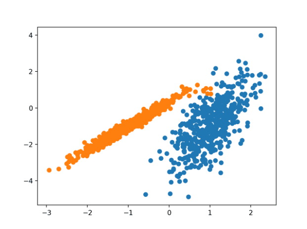
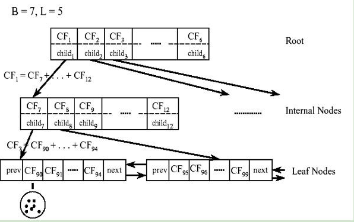

# BIRCH
[`BIRCH`](https://www.pallavikulkarni.in/incremental-clustering-with-birch-algorithm/) (`Balanced Iterative Reducing` and `Clustering` using `Hierarchies`) is used to perform hierarchical clustering over particularly large data-sets.  
With modifications it can also be used to accelerate `k-means` clustering and `Gaussian mixture` modeling with the expectation–maximization algorithm.  
An advantage of `BIRCH` is its ability to incrementally and dynamically cluster incoming, multi-dimensional metric data points in an attempt to produce the best quality clustering for a given set of resources (memory and time constraints).  
In most cases, `BIRCH` only requires a single scan of the database And this can lead to fast working cluster

  

  
  

### code 
[`python3 birch_scratch.py`](./birch_scratch.py)  
[`python3 birch.py`](./birch.py)  

## Resources
https://www.pallavikulkarni.in/incremental-clustering-with-birch-algorithm/  

https://github.com/annoviko/pyclustering/blob/master/pyclustering/cluster/birch.py  
https://en.wikipedia.org/wiki/BIRCH  
https://www.datatechnotes.com/2019/09/clustering-example-with-birch-method-in.html  
https://morioh.com/p/c23e0d680669  

<!-- # XX
[`XX`](simple explanation) 

  

  

### code 
[`python3 ...py`](./...py)  
[`python3 ...py`](./...py)  

## Resources -->