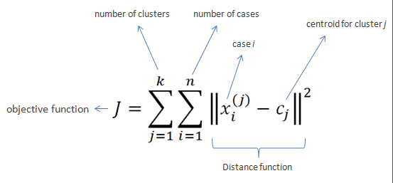
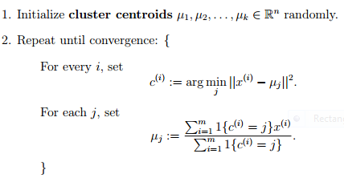

# K-means
[`K-means`](https://www.youtube.com/watch?v=_aWzGGNrcic) we are using it when we want to group the closest data to each other.  
Than we set the centroid in the center of this data and re-do this steps.
Untill there are no changes in the replacement of the centroid.

### deeper explanation
```txt
K-Means clustering intends to partition n objects into k clusters in which each object belongs to the cluster with the nearest mean.  
This method produces exactly k different clusters of greatest possible distinction.  
The best number of clusters k leading to the greatest separation (distance) is not known as a priori and must be computed from the data.  
The objective of K-Means clustering is to minimize total intra-cluster variance, or, the squared error function: 
```
<p align="center">
  
  
</p>
<p align="center">
  
</p>

### code 
[`python3 k_means.py`](./k_means.py)  
[`python3 k_means_scratch.py`](./k_means_scratch.py)  

## Resources   
https://developers.google.com/machine-learning/clustering/algorithm/run-algorithm  
https://realpython.com/k-means-clustering-python/  
https://medium.com/machine-learning-algorithms-from-scratch/k-means-clustering-from-scratch-in-python-1675d38eee42  
https://stanford.edu/~cpiech/cs221/handouts/kmeans.html  
https://www.saedsayad.com/clustering_kmeans.htm  
https://mmuratarat.github.io/2019-07-23/kmeans_from_scratch  
