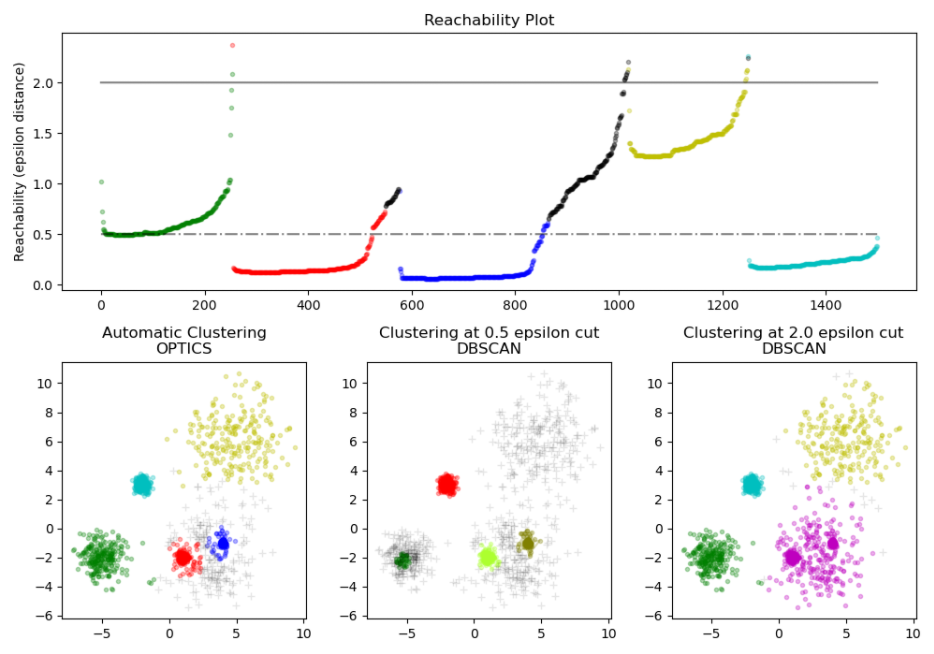
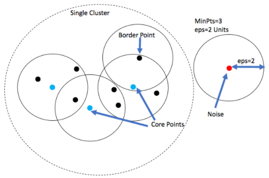
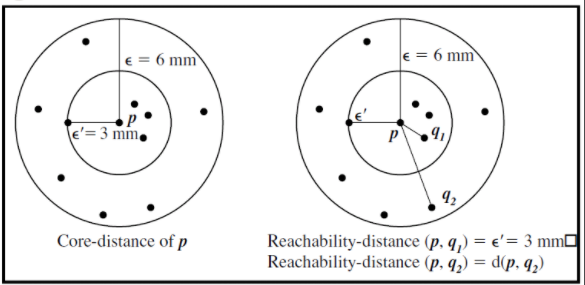

# OPTICS
`Ordering` `Points` `To` `Identify` the `Clustering` `Structure` ([`OPTICS`](https://en.wikipedia.org/wiki/OPTICS_algorithm)) is an algorithm for finding density-based clusters in spatial data.  
Its basic idea is similar to DBSCAN, but it addresses one of DBSCAN's major weaknesses: the problem of detecting meaningful clusters in data of varying density.  
To do so, the points of the database are (linearly) ordered such that spatially closest points become neighbors in the ordering.  
Additionally, a special distance is stored for each point that represents the density that must be accepted for a cluster so that both points belong to the same cluster.(This is represented as a dendrogram.)

  

  
  

### code 
[`python3 optics_scratch.py`](./optics_scratch.py)  
[`python3 optics.py`](./optics.py)  

Note:
scratch one i did not build because i do not see the difference of DBSCAN and OPTICS to much (need docs reading)

## Resources
https://www.dbs.ifi.lmu.de/Publikationen/Papers/OPTICS.pdf  
https://thinkingneuron.com/data-science-interview-questions-for-it-industry-part-4-unsupervised-ml/#OPTICS  
https://www.geeksforgeeks.org/ml-optics-clustering-implementing-using-sklearn/  
https://www.machinecurve.com/index.php/2020/12/15/performing-optics-clustering-with-python-and-scikit-learn/  
https://livebook.manning.com/book/machine-learning-for-mortals-mere-and-otherwise/chapter-18/5  
https://github.com/Darkprogrammerpb/DeepLearningProjects/blob/master/Project42/OPTICS_clustering/Optics.ipynb  

#### maybe:  
https://github.com/aonghus/optics-cluster/blob/master/optics.py  
https://github.com/mannmann2/Density-Based-Clustering/blob/master/optics.py  
