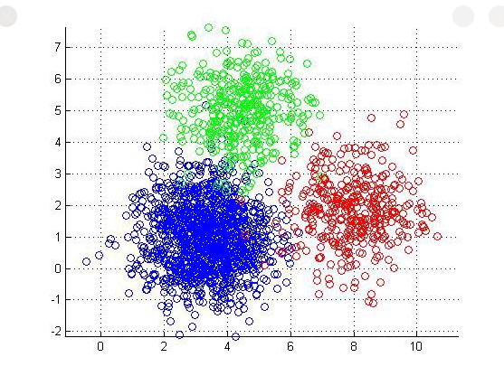
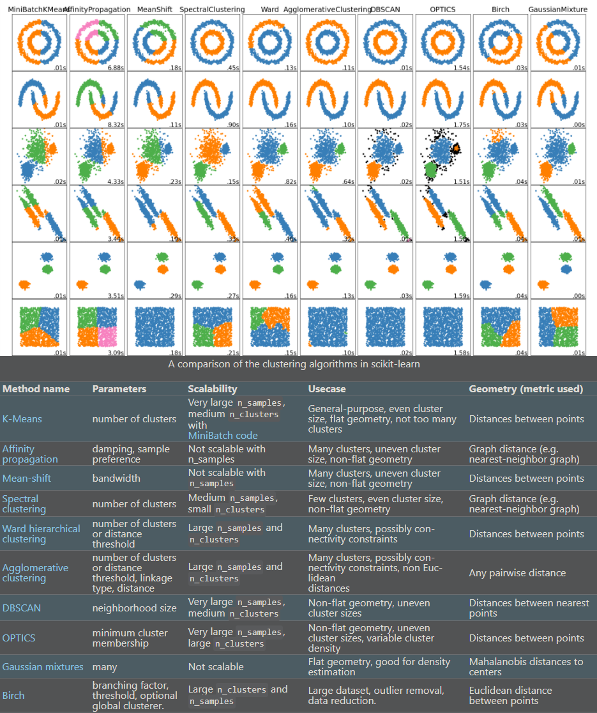

# Clustering
[`Clustering`](https://www.freecodecamp.org/news/8-clustering-algorithms-in-machine-learning-that-all-data-scientists-should-know/) means you're going to give the algorithm a lot of input data with no labels and let it find any groupings in the data it can.  

Those groupings are called clusters.  
A cluster is a group of data points that are similar to each other based on their relation to surrounding data points.  
Clustering is used for things like feature engineering or pattern discovery.

When you're starting with data you know nothing about, clustering might be a good place to get some insight.

  

  

## About
The purpose of this is not to produce as optimized and computationally efficient algorithms as possible.
but rather to present the inner workings of them in a transparent and accessible way.

## Clustering Types
- [Affinity Propagation](./Affinity_Propagation)
- [Agglomerative Clustering](./Agglomerative_Clustering)
- [BIRCH](./BIRCH)
- [DBSCAN](./DBSCAN)
- [Guassian Mixture](./Gaussian_Mixture)
- [K-Means](./K-Means)
- [Mean Shift](./Mean_Shift)
- [OPTICS](./OPTICS)
- [Spectral Clustering](./Spectral_Clustering)

## Resources
https://scikit-learn.org/stable/modules/clustering.html  
https://developers.google.com/machine-learning/clustering
https://www.freecodecamp.org/news/8-clustering-algorithms-in-machine-learning-that-all-data-scientists-should-know/  

<!-- 
(in `BIRCH` and we still need to create the scratch file and a double check on `OPTICS` 
there could be some wrong calculation going on, for 2 new scratch samples i added in the readme).

Check:
 - ./OPTICS
 - ./BIRCH
-->