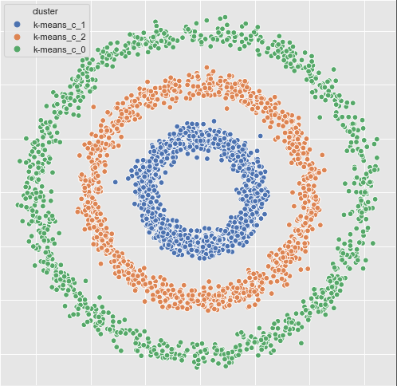
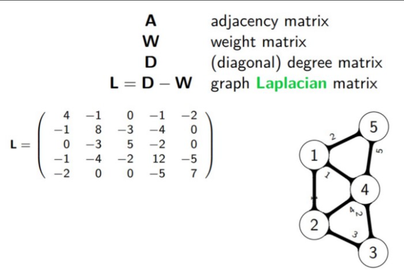

# Spectral Clustering
[`Spectral clustering`](https://www.youtube.com/watch?v=3heWpR6dC8k) is a very powerful clustering method.  
Unlike `k-means`, `spectral clustering` doesn’t make assumptions related to shape of clusters. 
K-means clustering assumes that all clusters are spherical (and that’s how ‘k’ means become representatives of respective clusters.  
But in spectral clustering there is no such assumption, even the clusters which are intertwined spirals can also be identified.  
`Spectral clustering` gives importance to connectivity (within data points) rather than compactness (around cluster centers).

  

  

  

### code 
[`python3 spectral_clustering_scratch.py`](./spectral_clustering_scratch.py)  
[`python3 spectral_clustering.py`](./spectral_clustering.py)

## Resources  
https://towardsdatascience.com/spectral-clustering-for-beginners-d08b7d25b4d8  
https://www.datatechnotes.com/2020/12/spectral-clustering-example-in-python.html  
https://medium.com/@tomernahshon/spectral-clustering-from-scratch-38c68968eae0  
https://juanitorduz.github.io/spectral_clustering/  
https://github.com/zhangyk8/Spectral-Clustering/blob/master/spectral_clustering.py  
https://www.datatechnotes.com/2020/12/spectral-clustering-example-in-python.html

##### advanced:
https://www.mygreatlearning.com/blog/introduction-to-spectral-clustering/  
http://www.tml.cs.uni-tuebingen.de/team/luxburg/publications/Luxburg07_tutorial.pdf  

##### real world sample:  
https://github.com/metterlein/spectral_clustering/blob/master/notebooks/Real%20Data%20Example.ipynb  