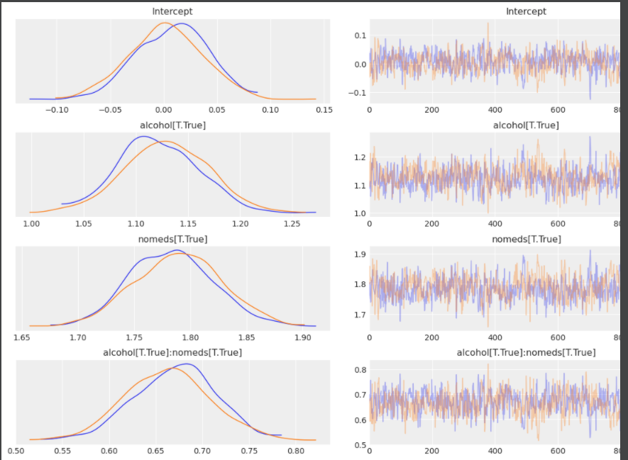
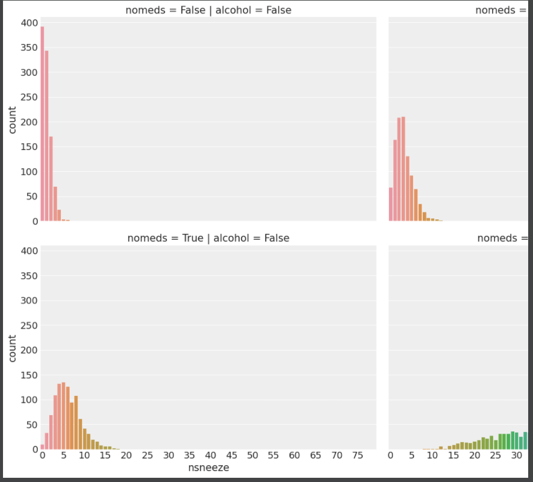
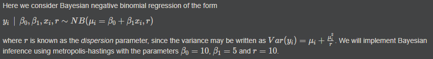

# Negative Binomial Regression
`Negative binomial regression` is used to model count data for which the variance is higher than the mean.  
The `negative binomial distribution` can be thought of as a `Poisson distribution` whose rate parameter is gamma distributed, so that rate parameter can be adjusted to account for the increased variance.

To understand `Negative Binomial Regression` , it would be nice to learn first:
- [Poisson Regression](../poisson_regression)

<p align="center">
  
  
</p>
<p align="center">
  
</p>   

# Get Started
```cmd
cd ML_Regressions/negative_binomial_regression
python3 negative_binomial_regression.py
```

# Resources
- https://docs.pymc.io/notebooks/GLM-negative-binomial-regression.html
- https://ncss-wpengine.netdna-ssl.com/wp-content/themes/ncss/pdf/Procedures/NCSS/Negative_Binomial_Regression.pdf
- https://www.geeksforgeeks.org/python-negative-binomial-discrete-distribution-in-statistics/
- https://kieranrcampbell.github.io/blog/2015/03/31/tutorial-bayesian-nb-regression.html

