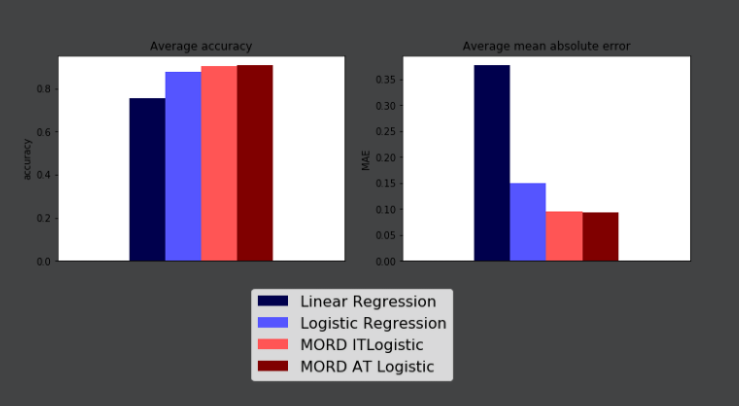
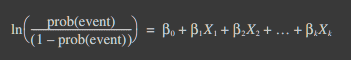

# Ordinal Regression
[sample code](./ordinal_regression.py)

Ordinal regression is a member of the family of regression analyses.  
As a predictive analysis, ordinal regression describes data and explains the relationship between one dependent variable and two or more independent variables.  
The independent variables are added linearly as a weighted sum of the form.


<p align="center">
  
</p>
<p align="center">
  
</p>   

## Get Started
```cmd
cd ML_Regressions/ordinal_regression
python3 ordinal_regression.py
```

# Resources
- https://medium.com/datalab-log/ratings-based-on-human-assessment-a-regression-or-a-classification-problem-60cf91552e95
- https://betanalpha.github.io/assets/case_studies/ordinal_regression.html
- https://www.norusis.com/pdf/ASPC_v13.pdf
- https://www.statsmodels.org/devel/examples/notebooks/generated/ordinal_regression.html