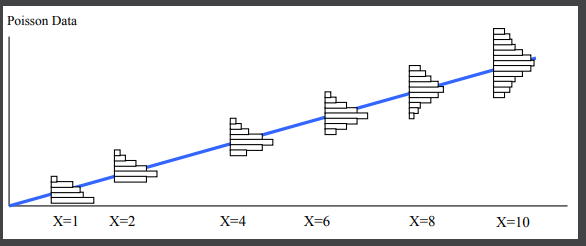
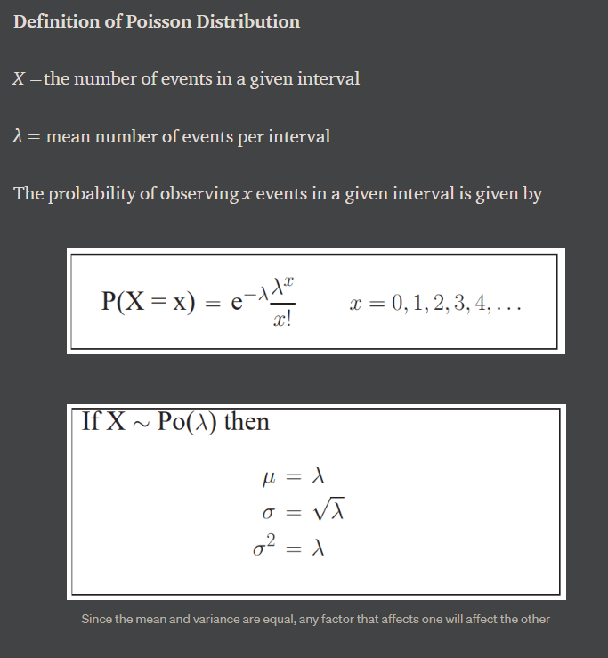

# Poisson Regression
[sample code](./poisson_regression.py)

Poisson regression assumes the response variable Y has a Poisson distribution, and assumes the logarithm of its expected value can be modeled by a linear combination of unknown parameters. A Poisson regression model is sometimes known as a log-linear model, especially when used to model contingency tables.
 

<p align="center">
  
  
</p>
<p align="center">
  
</p>   

## Get Started
```cmd
cd ML_Regressions/poisson_regression
python3 poisson_regression.py
```

# Resources
- https://datascience.oneoffcoder.com/autograd-poisson-regression-gradient-descent.html
- https://scikit-learn.org/stable/auto_examples/linear_model/plot_poisson_regression_non_normal_loss.html
- https://medium.com/tencent-thailand/intro-to-poisson-regression-22fb33918839
- https://ncss-wpengine.netdna-ssl.com/wp-content/themes/ncss/pdf/Procedures/NCSS/Poisson_Regression.pdf


