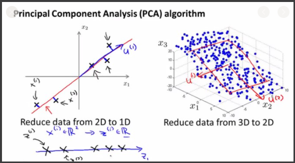
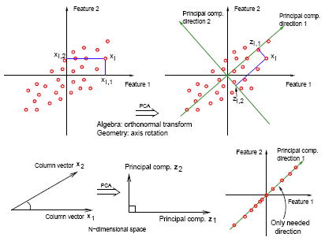
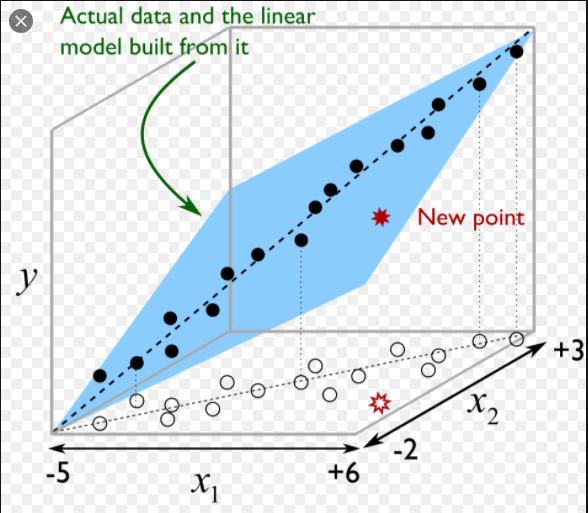
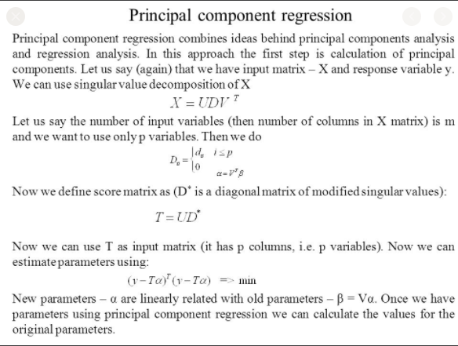

# Principal Components Regression (PCR)
[sample code](./principal_components_regression.py)  

Principal Components Regression is a technique for analyzing multiple regression data that suffer from multicollinearity.  
When multicollinearity occurs, least squares estimates are unbiased, but their variances are large so they may be far from the true value.  
By adding a degree of bias to the regression estimates, principal components regression reduces the standard errors. It is hoped that the net effect will be to give more reliable estimates.  
Another biased regression technique is `Ridge Regression`, which is more popular these times.    

To understand `Principal Components`, it would be nice to learn first:
- [Ridge Regression](../ridge_regression)
<p align="center">
  
</p>   
<p align="center">
  
  
</p>   
<p align="center">
  
</p>   

## Get Started
```cmd
cd ML_Regressions/principal_components_regression
python3 principal_components_regression.py
```

# Resources
- https://www.kaggle.com/phamvanvung/partial-least-squares-regression-in-python
- https://nirpyresearch.com/principal-component-regression-python/

#### (extra)
- https://machinelearningmastery.com/calculate-principal-component-analysis-scratch-python/
- https://drscotthawley.github.io/blog/2019/12/21/PCA-From-Scratch.html
- https://www.kaggle.com/nirajvermafcb/principal-component-analysis-explained