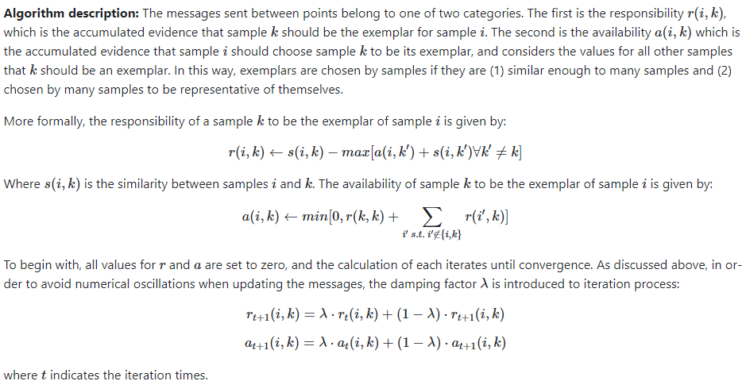

# Affinity Propagation
[`Affinity Propagation`](https://www.youtube.com/watch?v=NaldkmCouLw) we are using it when we want to group the closest data to each other.  
By sending messages between pairs of samples until convergence.  
A dataset is then described using a small number of exemplars, which are identified as those most representative of other samples.  
The messages sent between pairs represent the suitability for one sample to be the exemplar of the other, which is updated in response to the values from other pairs.  
This updating happens iteratively until convergence, at which point the final exemplars are chosen, and than the final clustering is given.

  

  

### code 
[`python3 affinity_propagation.py`](./affinity_propagation.py)  
[`python3 affinity_propagation_scratch.py`](./affinity_propagation_scratch.py)  

## Resources   
most happy with https://www.ritchievink.com/blog/2018/05/18/algorithm-breakdown-affinity-propagation/  
https://scikit-learn.org/stable/modules/clustering.html#affinity-propagation  
https://hdbscan.readthedocs.io/en/latest/comparing_clustering_algorithms.html#affinity-propagation  
https://machinelearningmastery.com/clustering-algorithms-with-python/  
https://medium.com/@aneesha/using-affinity-propagation-to-find-the-number-of-clusters-in-a-dataset-52f5dd3b0760  
https://github.com/abhinavkashyap92/affinity_propagation/blob/master/affinity_prop.py
