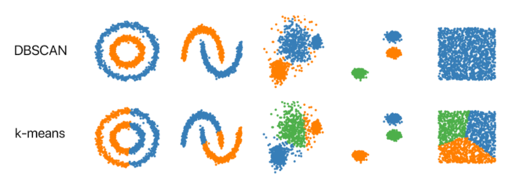
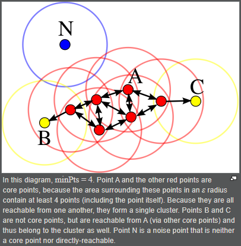

# DBSCAN
[`DBSCAN`](https://en.wikipedia.org/wiki/DBSCAN)  
(`Density-Based` `Spatial` `Clustering` `Application` with `Noise`) makes clusters based upon the density of the data points or how close the data is.  
That said, the points which are outside the dense regions are excluded and treated as noise or outliers. This characteristic of the DBSCAN algorithm makes it a perfect fit for outlier detection and making clusters of arbitrary shape. The algorithms like K-Means Clustering lack this property and make spherical clusters only and are very sensitive to outliers. By sensitivity, I mean the sphere-shaped clusters made through K-Means can easily get influenced by the introduction of a single outlier as they are included too.

  

  

  

### code 
[`python3 dbscan_scratch.py`](./dbscan_scratch.py)  
[`python3 ./dbscan.py`](./dbscan.py)  

## Resources
https://www.analyticsvidhya.com/blog/2020/09/how-dbscan-clustering-works/  
https://towardsdatascience.com/dbscan-make-density-based-clusters-by-hand-2689dc335120  
https://www.programmersought.com/article/584396849/  
https://medium.com/nearist-ai/dbscan-clustering-tutorial-dd6a9b637a4b
https://xzz201920.medium.com/dbscan-e1e50128074c  
https://github.com/eriklindernoren/ML-From-Scratch/blob/master/mlfromscratch/unsupervised_learning/dbscan.py   
http://madhugnadig.com/articles/machine-learning/2017/09/13/implementing-dbscan-from-scratch-in-python-machine-learning.html  
https://www.kdnuggets.com/2020/04/dbscan-clustering-algorithm-machine-learning.html  

